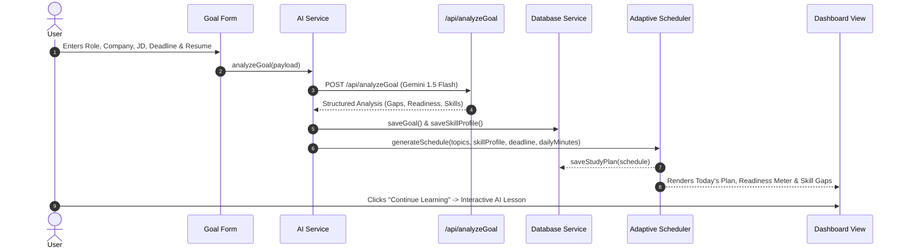

# Path Forge — Adaptive AI Career Preparation Platform Architecture

## 1. System Philosophy

Path Forge is **not** a passive course platform or a generic LLM wrapper. It is an **adaptive AI career preparation operating system**:

```text
                  CAREER GOAL
                       ↓
              RESUME + JOB REQUIREMENTS
                       ↓
               SKILL GAP ANALYSIS
                       ↓
              PERSONALIZED PLAN
                       ↓
                 AI TEACHER
                       ↓
                  PRACTICE
                       ↓
                  QUESTIONS
                       ↓
                  EVALUATION
                       ↓
               SKILL MODEL UPDATE
                       ↓
               PLAN RESCHEDULING
                       ↓
                 NEXT LESSON
                       ↓
                     ...
                       ↓
                   JOB READY
```

Every user answer produces learning data. Every learning result dynamically changes the future schedule. The plan is alive.

---

## 2. Directory Structure & Responsibilities

```text
Path_Forge/
│
├── index.html                   # Semantic HTML5 application shell & view containers
├── package.json                 # Project configuration ("type": "module")
├── README.md                    # Platform documentation & setup guide
├── .gitignore                   # Version control ignore rules (strictly ignores .env.local)
├── .env.local                   # Local credentials template (never committed)
├── .env.example                 # Tracked reference template with blank values
│
├── public/                      # Static assets (images, icons, fonts)
│
├── src/                         # Modular Client Application (ES6+)
│   ├── app.js                   # Master application orchestrator & routing state machine
│   │
│   ├── data/                    # Pure declarative datasets
│   │   ├── pathways.js          # 12 baseline career tracks (Tech & Non-Tech)
│   │   ├── quizQuestions.js     # Role recommendation questionnaire
│   │   └── curriculum.js        # Topic dependency graph, prerequisites & duration weights
│   │
│   ├── components/              # UI View Controllers
│   │   ├── auth/                # Login modal & user menu badge
│   │   ├── home/                # Hero CTA ("SET YOUR GOAL") & track preview
│   │   ├── goal/                # Goal setup form & AI gap analysis summary
│   │   ├── dashboard/           # Job readiness meter, skill profile & today's action plan
│   │   ├── learning/            # AI concept teacher, practice questions & misconception feedback
│   │   ├── roadmap/             # Visual adaptive schedule timeline with status badges
│   │   ├── notes/               # Study guide viewer, TXT download & PDF export
│   │   ├── quiz/                # Career preference questionnaire
│   │   └── profile/             # Candidate profile & data reset controls
│   │
│   ├── services/                # Business Logic & Integration Layer
│   │   ├── auth/                # Google sign-in & session management
│   │   ├── database/            # Unified persistence interface with local fallback
│   │   ├── ai/                  # AI task router & provider abstraction (Gemini)
│   │   ├── learning/            # Bounded skill engine & assessment evaluation
│   │   ├── scheduler/           # Deterministic mathematical calendar & reinforcement engine
│   │   └── storage/             # Cache, offline storage & legacy migration
│   │
│   ├── utils/                   # Shared Utilities & FX Engines
│   │   ├── dom.js               # DOM query & safe event handling
│   │   ├── validation.js        # Input sanitization, AI JSON parsers & boundary clamps
│   │   └── animations.js        # Constellation canvas, cursor follower & confetti
│   │
│   └── styles/                  # Modular Stylesheets
│       ├── base.css             # Resets, custom scrollbar & tech grid backdrop
│       ├── components.css       # Glass cards, modal layers & badges
│       └── animations.css       # Keyframes, glows & custom cursor effects
│
├── api/                         # Secure Serverless Backend Endpoints
│   ├── generate.js              # AI Career Advisor chat endpoint
│   ├── analyzeGoal.js           # Resume & job description gap analyzer
│   ├── generateLesson.js        # Structured concept lesson generator
│   ├── evaluateAnswer.js        # Misconception evaluator
│   └── generateNotes.js         # Study notes & interview prep synthesizer
│
└── docs/                        # Complete Technical Documentation
    ├── architecture.md          # Full system architecture (this file)
    ├── database.md              # Entity schemas & security rules
    ├── learning-engine.md       # Skill mastery mathematics & update formulas
    ├── scheduler.md             # Deterministic scheduling algorithm details
    └── ai.md                    # AI endpoints, models & boundary isolation
```

---

## 3. Separation of Concerns Principle

$$\mathbf{DATA} \neq \mathbf{UI\ COMPONENTS} \neq \mathbf{BUSINESS\ LOGIC} \neq \mathbf{STORAGE} \neq \mathbf{API}$$

1. **Data Layer (`src/data/`)**: Pure read-only declarative knowledge graphs (curriculum, prerequisites, role catalogs).
2. **Components (`src/components/`)**: Pure presentation and user interaction; components never perform raw database queries or direct AI API calls.
3. **Services (`src/services/`)**: The computational engine of the platform:
   - `scheduler.js` performs pure mathematical date budgeting without AI overhead.
   - `skillEngine.js` performs bounded skill mastery updates.
   - `databaseService.js` handles entity persistence.
4. **Backend API (`api/`)**: Serverless endpoints keeping the `GEMINI_API_KEY` private and isolated from browser exposure.

---

## 4. Lifecycle & Data Flow


